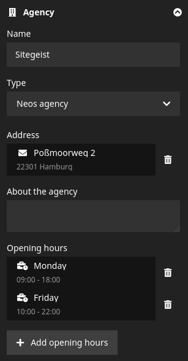
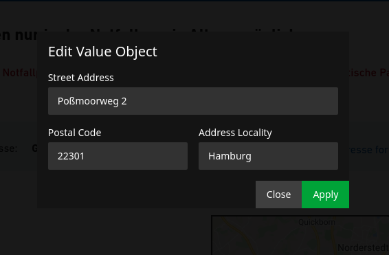

# Sitegeist.InspectorGadget

This package provides the Neos inspector with a gadget plugin to properly handle value objects.
This is aimed at more complex node type properties like postal addresses,
that need combined validation and otherwise tend to clutter the inspector with all their input fields.
Instead, they are rendered as a preview button and edited in an overlay using a react form component.
It also supports collection types to manage multiple values in a single property.


<br /><small>The inspector with a PostalAddress value object and a collection of OpeningHoursSpecification value objects</small>


<small>The form to edit a PostalAddress value object in an overlay</small>
## Installation

```
composer require sitegeist/inspectorgadget
```

## Documentation

1. [Using value objects in your NodeType](./Documentation/01_ValueObjects.md)
2. [Using collection types in your NodeType](./Documentation/02_CollectionTypes.md)

## LICENSE

see [LICENSE](./LICENSE)
